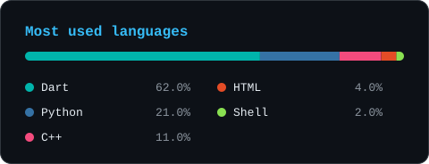

<!-- BANNER: animated terminal dashboard. Generated by scripts/banner/generate.py -->
<picture>
  <source media="(prefers-color-scheme: dark)"  srcset="assets/banner-dark.svg">
  <source media="(prefers-color-scheme: light)" srcset="assets/banner-light.svg">
  
</picture>

 

 

  

---

## This is me :)

Hi, I'm **Riddhima Gupta** 👋, a B.Tech Computer Engineering student and Flutter Developer.
I'm interested in building cross-platform applications, working with backend APIs, and contributing to open source.

- 🎓 **B.Tech in Computer Engineering** at Maharishi Markandeshwar (Deemed to be University), Mullana - current CGPA **8.9**.
- 📱 **Flutter Developer Intern** at Wesalvout Technologies, working on the Crescent Academy EdTech platform.
- 🧩 Building and maintaining mobile applications with **Flutter and Dart**, REST APIs, Firebase, authentication, notifications, and state management.
- 🌐 **GSSoC 2026 Contributor**, contributing to open-source projects across Flutter, React, Python, and web technologies.
- 🤝 **Core Member of GDG on Campus MM(DU)**, helping organize workshops, coding events, and hackathons.
- 🏆 **1st Runner-Up at Tech4SDG 2.0 Ideathon** and finalist at Hackureka Hackathon.
- 💬 Talk to me about **Flutter, mobile development, REST APIs, Firebase, Git/GitHub, or open source**.

## my perfect stack

---

## Featured projects

| Project | What I worked on |
|---|---|
| 🎓 **Crescent Academy** | Production-ready EdTech platform with Student, Instructor, and Admin modules; REST APIs, authentication, course management, quizzes, notifications, analytics, and live classes. |
| 💬 **DocTalk** | Flutter healthcare communication app with doctor-patient appointments, real-time chat, Firebase Authentication, Cloud Firestore, and responsive UI. |
| 🏫 **Campus Connect** | Campus community platform for announcements, events, student interactions, authentication, post management, and real-time data synchronization. |
| 🥫 **Smart Pantry** | Grocery inventory management app with expiry tracking, stock alerts, product categorization, and Firebase Firestore synchronization. |

---

## signals

<table>
<tr>
<td width="50%" align="center" valign="middle">
<picture>
  <source media="(prefers-color-scheme: dark)"  srcset="assets/radar-dark.svg">
  <source media="(prefers-color-scheme: light)" srcset="assets/radar-light.svg">
  
</picture>
</td>
<td width="50%" align="center" valign="middle">
<picture>
  <source media="(prefers-color-scheme: dark)"  srcset="assets/radar-langs-dark.svg">
  <source media="(prefers-color-scheme: light)" srcset="assets/radar-langs-light.svg">
  
</picture>
</td>
</tr>
</table>

---

## Open source & community

**GirlScript Summer of Code (GSSoC) 2026 - Contributor**

- Contributed to projects involving Flutter, React, Python, and web technologies.
- Worked on UI improvements, validation, feature enhancements, testing, and code refactoring.
- Collaborated with maintainers through GitHub Issues, Pull Requests, and code reviews.

**Google Developers Group On Campus MM(DU) - Core Member**

- Helped organize technical workshops, coding events, and hackathons.
- Coordinated volunteers and supported event logistics and student participation.

---

## Achievements

- 🥈 **1st Runner-Up : Tech4SDG 2.0 Ideathon** (2026)
- 🏁 **Finalist : Hackureka Hackathon** (2025)
- 🎯 **Organizer : Hackureka 2.0 National Level Hackathon**, with 600+ registrations and 300+ participants in the hybrid event.
- 💻 **Organizer : Tech Hunt 2.0**, with 100+ student participants.

---

## Numbers matter? ohhh yes.

<!-- Generated by scripts/cards.py into this repo (no third-party stat services). -->
<picture>
  <source media="(prefers-color-scheme: dark)"  srcset="assets/card-stats-dark.svg">
  <source media="(prefers-color-scheme: light)" srcset="assets/card-stats-light.svg">
  
</picture>

 

<picture>
  <source media="(prefers-color-scheme: dark)"  srcset="assets/card-langs-dark.svg">
  <source media="(prefers-color-scheme: light)" srcset="assets/card-langs-light.svg">
  
</picture>

---

> "Learning by building, contributing, and shipping."

Built with love · @riddhimagupta2

